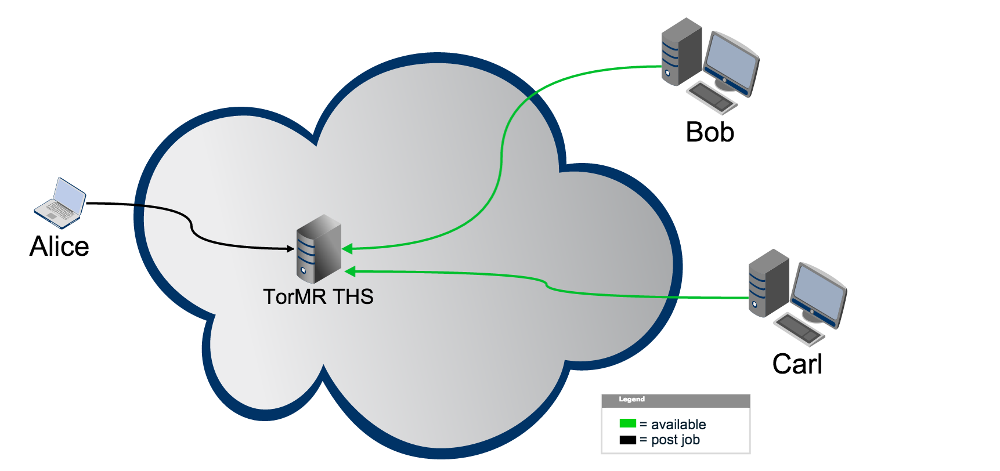
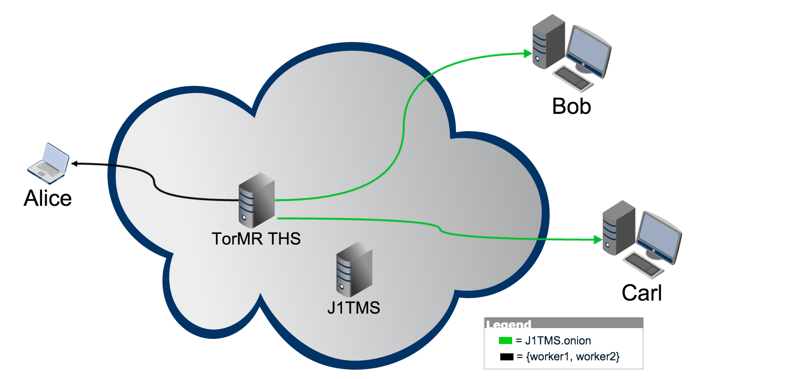
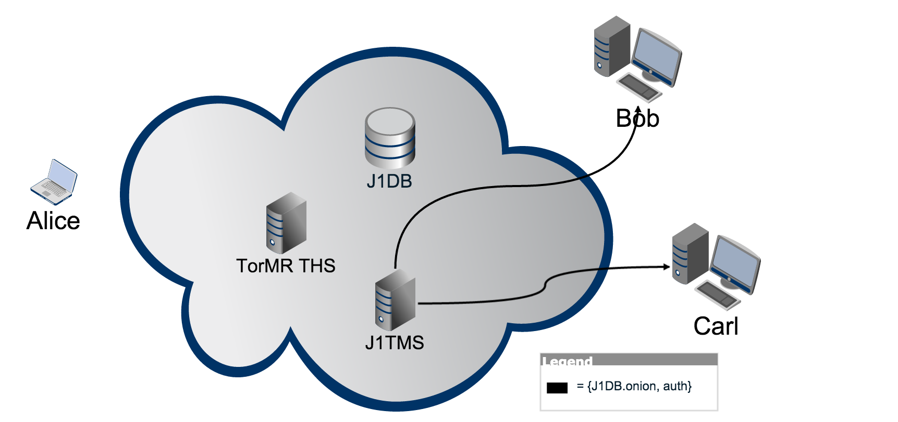
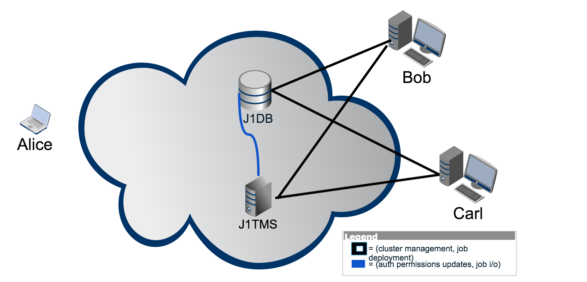

# Introduction

Parallel data processing methods have allowed people of all professions to analyze data at an unprecedented scale, yielding key insights in myriad industries and academic disciplines. Contemporaneously (and not entirely independently), data privacy has become an important and immediate issue in our society. Organizations in both the public and private sectors constantly collect or access data on their users or constituents, often without explicit consent by the individual. As computing continues to shift into "the cloud" from users' local systems, user data is relinquished to, and becomes centralized in, the small number of prevalent cloud service providers. In distributed parallel data processing, where clusters of multiple physical or virtual machines execute jobs in parallel, this introduces a potential for privacy and confidentiality compromises of users' data, as well as results of their computations. Even assuming an entirely privacy-respecting benign cluster provider, the contemporary model of centralized cluster control provides an attack focus for malicious hackers. Though there are many different architectures for parallel and distributed processing, we will focus exclusively on the MapReduce paradigm in this project.

# Problem Statement

So, how can we protect the privacy of users' data and computations while still affording the user all (or at least most) of the major features of modern distributed data processing architectures? We need a system that:

  1. is decentralized (peer-to-peer) in architecture with granular data access control, to prevent a malicious peer from being able to see too great a portion of the user's data.[^1]
  2. preserves _all_ users' anonymity[^2], keeping them hidden from other peers in the cluster.
  3. maintains compatibility with existing MapReduce implementations without requiring the user to re-write large portions of their code base.

# TorMR

We propose a system called TorMR which implements the Map Reduce paradigm, but manages clusters over the Tor network. Users who wish to accrue a cluster register a request with TorMR's bulletin-board, which is protected behind a Tor Hidden Service (**THS**). Other users who wish to volunteer their nodes' compute power register them as available workers with the bulletin board THS, and when enough nodes are available, a cluster is formed. Worker nodes on the cluster are unaware of each others' locations (IP addresses), as is the node requesting the compute job, as all communication is through Tor's hidden service protocol.

# Privacy Model
## Location & Identity

## Data Encryption

## Only A Small Picture

# Components
## TorMR/Bulletin-Board THS

## Job THS

## Discovery & Cluster Management

## Distributed Data Layer/File System

# Protocol
**NOTE:** I mislabelled a few of the figures. "J1TMS" _should_ be "J1THS". my apologies, I will correct this soon.  

  1.  Alice requests a cluster ($n=2$ in this instance) on the TorMR Bulletin-Board THS. Bob and Carl register with bulletin-board as "available".

  2.  TorMR THS alerts Alice that her request has accrued the desired number of compute nodes. TorMR THS gives Bob and Carl the `.onion` address of Alice's Job 1 THS (J1THS), where she has installed in advance all of her job data, code, and cluster management software.

  - **NOTE:** I skipped a step here. There should be a diagram of Bob and Carl registering with J1THS before J1THS handles db stuff. will insert soon.

  3.  J1THS sends Bob and Carl the `.onion` address of Job 1's database/data layer. In addition to this, J1THS gives Bob and Carl authentication or encryption/decryption[^3] credentials for sectors of J1DB pertinent to their assigned tasks, as determined by Alice-controlled J1DB. At this point, all necessary components are aware of one-another.

  4.  J1THS, who will function as the "master" node in the impending MR job, assigns tasks and pushes containerized job deployments to all worker nodes (in this example, just Bob and Carl) in the cluster. Once all containers are up and running their respective tasks (mappers or reducers, as HTTP servers), J1THS runs the job via HTTP. J1THS reads/writes from J1DB throughout the job in order to manage the cluster.[^4] As the diagram is somewhat misleading, it should be noted that this connection between J1THS and J1DB needn't be through Tor, as they're both controlled by Alice. The two could be running on the same virtual server off somewhere in "the cloud".

# Tools, Dependencies, & Technologies
## Tor

## golang

## Pachyderm MapReduce

## git

## Docker

## CoreOS & etcd

# Development & Deployment Methodologies
## Source Testing

## Vagrant

## VirtualBox

## Compute Cluster

# Relaxations & Substitutions in the Interest of Feasibility

# Deliverables
  1. code for simulations/proof of concept
  2. code documentation
  3. formal document containing description of project, implementation details & design decisions, and analysis of experimental results.

# Vulnerabilities & Fault Points

# Future Work
  - dynamic cluster management
  - fully anonymous (self-hosted) data layer
  - payment system (probably via BTC)
  - pipeline implementation
    + this should be implemented as a dumb pipe for compute jobs
    + replace Bulletin-Board THS with job queue
    + instead of matching available workers with individual jobs, keep them as pool (i.e. all available workers are part of same super-cluster)
    + users register their jobs as a git repository
    + when job is up in queue, job is `git push`'d to the cluster where it is executed. data is read/results are written from/to specified storage buckets
    + as part of job definition, requester must specify storage bucket address.

# Timeline & Milestones
|  **Deadline** |                          **Goal**                           |
|:-------------:|-------------------------------------------------------------|
|    2/22/15    | get sample MR job running on virtual cluster blah di blah d |
|               | continuation blah di blah blah |
|    3/01/15    | |
|    3/08/15    | |
|    3/15/15    | |
|    3/22/15    | |
|    3/29/15    | |
|    4/05/15    | |
|    4/12/15    | |
|    4/29/15    | All done!                     

[^1]:  this may be susceptible to sybil attacks
[^2]:  or at least pseudonymity
[^3]:  I'm still deciding how to granularly control data privacy (i.e. - such that only nodes whose task is pertinent to a particular section of data can see it). It will either be by managing database authentication permissions or by encrypting specific "buckets" of the data and controlling dissemination of their respective keys (or possibly a combination of the two approaches).
[^4]:  This would also be the connection through which J1THS would update authentication permissions in J1DB if the last footnote's former scheme is implemented. 
